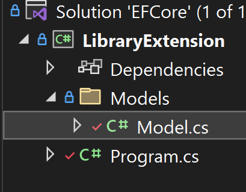

# Part 2 - Connect to your database with EF Core

## What is Entity Framework (EF) Core?

[Entity Framework Core](https://learn.microsoft.com/en-us/ef/) is a .NET tool that lets you build clean, portable, and high-level data access layers that work with a variety of databases and application types. EF Core lets you take the same intuitive approach to working with all data - no need to learn database-specific knowledge like writing SQL queries.

### Benefits of EF Core

- EF Core supports a huge range of SQL and NoSQL databases including SQL Database (on-premises and Azure), PostgreSQL, SQLite, MySQL, Azure Cosmos DB, and more! A full list of compatible data sources can be found [here](https://learn.microsoft.com/en-us/ef/core/providers/?tabs=dotnet-core-cli).
- EF Core lets you work with databases intuitively by putting data in the form of objects, which are much easier to workS with than raw output.
- Data access layers written using EF Core integrate seamlessly with any C# application, from console to mobile. You can also write multiple applications on top of the same back-end!
- EF Core offers important capabilities for application development, especially as you scale. These include debugging, logging, testing, change tracking, and much more.

EF Core works great for a variety of scenarios, whether you have an existing database or need to create and populate a new database, or even if you are a beginner to C# and/or code.

### Step 1 - Set up a .NET project that uses EF Core

Create a new .NET project named `EFDataLayer` using the CLI with this command:

```dotnetcli
dotnet new console -o EFDataLayer
cd EFDataLayer
```

You can also create your project using Visual Studio.

Now, add the correct Entity Framework Core package to your project. Since we are using a PostgreSQL database, we download its provider.

```dotnetcli
dotnet add package Microsoft.EntityFrameworkCore.PostgreSQL
```

Now, we are ready to open our project folder and work with some code.

#### Project Structure

There are three important parts of every EF Core project.



##### DbContext

An instance of the DbContext class represents a session of work with EF Core. In other words, it lets you define how you want to work with EF Core.

Because our project is so simple, we will define our `DbContext` in the `Model.cs` file. The DbContext class for your project should look like this:

```csharp

public class LibraryContext : DbContext
{
    public DbSet<Book> books { get; set; }
    public DbSet<Author> authors { get; set; }

    // The following configures EF to use a locally hosted postgres database
    protected override void OnConfiguring(DbContextOptionsBuilder optionsBuilder)
    {
        optionsBuilder.UseNpgsql("Host=localhost;Port=5432;Database=postgres;Username=postgres;Password=dabworkshop");
        // simple logging to console
        // optionsBuilder.LogTo(Console.WriteLine);
        // logging to console with log level
        optionsBuilder.LogTo(Console.WriteLine, LogLevel.Information);
    }
}
```

This code does a few things.

- Define instances of `DbSet`, which will contain the queried data in the form of objects in sets.
- Provide the connection string to the database you want to connect to.
- Configure how you want to work with EF Core - in this case, we turn on logging to help us debug.

##### Models

Your project should contain a Models folder with files that define the structure of your data. Though in this example you will write all of your models in just one `Model.cs` file, with larger projects it is recommended to break up your models across multiple files.

We will go into more depth later in this workshop, but here is an example of a data model class:

```csharp
public class Book
{
    public int id { get; set; }
    public string title { get; set; }

    public List<Author> Authors { get; } = new();
}
```

##### Program.cs

Your project will have a `Program.cs` file, where you will work with your database by calling the `DbContext` and models you have defined. This is also where you connect your data access layer to a front-end application.

```csharp
using Microsoft.EntityFrameworkCore; //download Microsoft.EntityFrameworkCore.SqlServer

await using var db = new LibraryContext();

// Read
Console.WriteLine("Querying");
```

#### What next?

- If you are working with an existing database and want to get started quickly, consider [reverse engineering your database](/part-2-efcore/step-2a-scaffolding.md) to generate your classes and tables from just a connection string. 
- If you are working with an existing database but want more guidance on transitioning from DAB to EF Core, consider [hand coding your data models](/part-2-efcore/part-2b-handcode.md).
- To create and populate a new database (for example, if you did not complete Part 1) consider [using migrations](/part-2-efcore/part-2c-migrations.md) to generate a database from your classes and tables quickly. The feature is similar to the `git` model for version control.

Regardless of what path you choose, you will end this section with a database with classes/tables and a .NET project set-up for your database. You are now ready for [Part 3: Querying and managing your data](/part-3-efcore-query-manage-data/).
