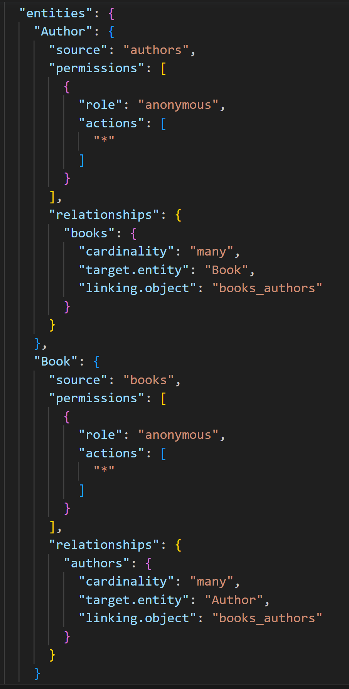
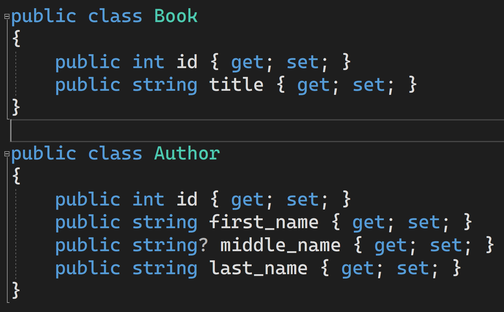
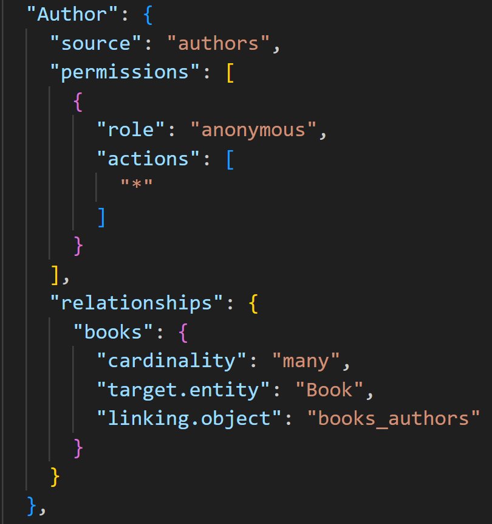
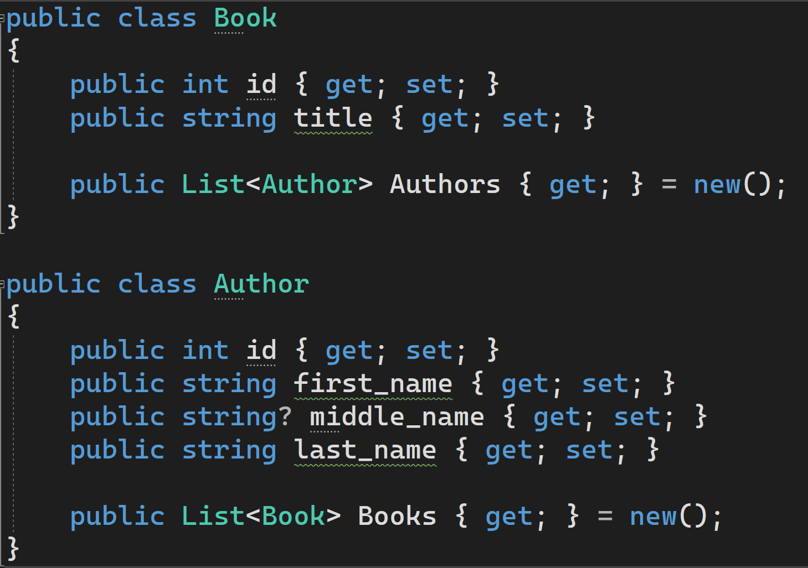

# Step 2b - Hand code your data model for an existing database (Database-first)

In this approach, we work with the existing populated PostgreSQL database from Part 1. Instead of generating scaffolding, we will define our classes and relationships based on `dab-config.json`, the configuration file generated by DAB, and the structure of our database. This approach will give you a deeper understanding of C# and how to translate your data access layer from DAB to EF Core.

## Write your data classes

Open your `dab-config.json` file and scroll down to the `entities` section.

There are two classes of entities - `Book` and `Author`, which draw from the `books` and `authors` tables in your database.

Let's take a look at your database.

Each entity has its own fields - books have titles, while authors have first, middle, and last names. Both have an `id` field, also known as an index.

Let's define our data model classes in C#. Include the following code in your `Model.cs` file.

## Define relationships

Let's take a closer look at the `Author` entity `dab-config.json`.

The `relationships` section describes what entities the `Author` entity has relationships with. In this case, it has a relationship with the `Book` entity with a cardinality of `many` - in other words, many books can be related to a single author. If you look at the `Book` entity, you will notice that it too has a many-to-one relationship with the `Author` entity - many authors can be related to a single book.

In EF Core, many-to-one relationships are represented in the form of a `List` that is part of the data model class definition. Define a `List` in each of your `Author` and `Book` model classes.

## Next Steps
